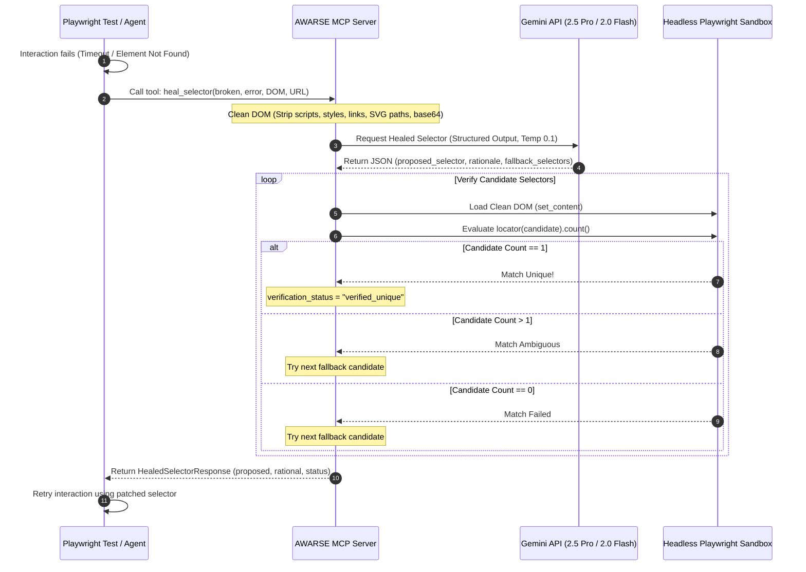

# AWARSE: Autonomous Playwright Self-Healing Selector Engine

AWARSE is a production-grade **Autonomous Playwright Self-Healing Selector Engine** operating as a Model Context Protocol (MCP) server. It intercepts broken browser locators at runtime, analyzes the target DOM snapshot using Gemini via Structured Outputs, verifies selector candidates in a sandboxed headless browser, and hot-patches the locator for the client.

---

## 📐 Architecture Flow



---

## 🚀 Key Features

* **DOM Sanitizer & Token Optimizer**: Discards all `<script>`, `<style>`, `<link>`, and comment blocks. Replaces bloated inline base64 images and strips verbose `<svg>` XML paths to minimize LLM token consumption and context window latency by **80%–90%**.
* **Gemini Orchestration Layer**: Utilizes the modern `google-genai` SDK and leverages **Structured Outputs** via Pydantic model validation with low temperature (`0.1`) for highly deterministic locating strategies (prioritizing accessibility roles, `data-testid`, and stable text anchors).
* **Sandboxed Headless Verification Loop**: Automatically verifies selector uniqueness (`count === 1`) inside an ephemeral, sandboxed Playwright Chromium page using the actual DOM state before returning the selector.
* **Dual Transport Support**: Exposes standard I/O (`stdio`) for local IDE integration and streamable HTTP/SSE for remote pipelines or shared infrastructure.
* **Seamless Client Fixtures**: Ready-to-inject fixtures for both Playwright TypeScript and Python test suites.

---

## ⚡ Quickstart

### 1. Prerequisite Installations
Ensure you have Python 3.11+ installed. We recommend using `uv`, a fast, modern Python package manager.

```bash
# Clone the repository
git clone https://github.com/skildunne/awarse-mcp.git
cd awarse-mcp
```

### 2. Configure Environment
Create a `.env` file in the root of the project:
```env
GEMINI_API_KEY="your-gemini-api-key"
GEMINI_MODEL="gemini-2.5-pro"  # Defaults to gemini-2.5-pro
AWARSE_HOST="0.0.0.0"
AWARSE_PORT=8000
AWARSE_MOCK_HEAL=false          # Set to true for offline testing
```

### 3. Install Dependencies & Playwright
```bash
# Using modern package management (uv)
uv venv
source venv/bin/activate
uv pip install -r requirements.txt
uv run playwright install chromium --with-deps
```

### 4. Running the MCP Server
AWARSE can be executed in two transport modes:

* **Local stdio mode (Default)**:
  ```bash
  uv run src/server/mcp_server.py
  ```
* **Remote SSE mode**:
  ```bash
  uv run src/server/mcp_server.py sse
  ```

---

## ⚙️ MCP Client Integration

Add AWARSE to your coding assistants by applying the configuration blocks below. Make sure to replace `/path/to/awarse-mcp` with your actual repository path.

### Claude Desktop Configuration
Add this to your `claude_desktop_config.json` (located at `~/.config/Claude/claude_desktop_config.json` on Linux/macOS or `%APPDATA%\Claude\claude_desktop_config.json` on Windows):

```json
{
  "mcpServers": {
    "awarse-healer": {
      "command": "/path/to/awarse-mcp/venv/bin/python",
      "args": [
        "/path/to/awarse-mcp/src/server/mcp_server.py"
      ],
      "env": {
        "GEMINI_API_KEY": "YOUR_GEMINI_API_KEY_HERE"
      }
    }
  }
}
```

### Cursor Configuration
Add this to your Cursor settings under **MCP** -> **Add New MCP Server**:
* **Name**: `awarse-healer`
* **Type**: `stdio`
* **Command**: `/path/to/awarse-mcp/venv/bin/python /path/to/awarse-mcp/src/server/mcp_server.py`

---

## 🛠️ Exposed MCP Tool: `heal_selector`

Exposes the core healing tool to LLM agents:

### Input Schema
* `broken_selector` (string, required): The CSS, XPath, or Role locator that failed.
* `error_message` (string, required): The Playwright / Selenium timeout error details.
* `dom_snapshot` (string, required): The captured HTML/DOM content.
* `target_url` (string, optional): Contextual URL of the page.

### Output JSON Format
```json
{
  "proposed_selector": "button[data-testid='submit-btn']",
  "confidence_score": 0.95,
  "rationale": "The original '#submit-btn' ID attribute was removed during structural layout refactoring, but the accessibility text and data-testid tags remain stable.",
  "fallback_selectors": [
    "button:has-text('Submit')",
    "role=button[name='Submit']"
  ],
  "verification_status": "verified_unique"
}
```
*Note: `verification_status` can be `"verified_unique"`, `"ambiguous_match"`, or `"failed"`.*

---

## 🧪 Test Suite & Client Fixtures

### Running Unit/Integration Tests
Verify AWARSE's engine, DOM optimizer, and verifier sandbox by running the test suite:
```bash
# Run pytest tests
PYTHONPATH=. uv run pytest tests/
```

### Injecting into Playwright Suites
We have included implementation templates showing how to hot-patch selectors dynamically at runtime inside the `examples/` directory:
* **Playwright TypeScript (Page Fixture)**: See [examples/smartFixture.ts](examples/smartFixture.ts) (uses `@modelcontextprotocol/sdk` to query the AWARSE server over SSE).
* **Playwright Python (Pytest Fixture)**: See [examples/smart_locator.py](examples/smart_locator.py) (uses `mcp` stdio client to spin up the local server).
