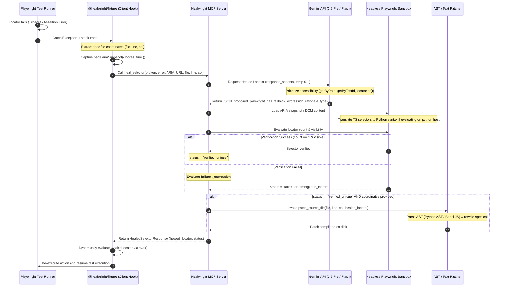

# Healwright: The autonomous Playwright self-healing engine that turns red CI pipelines green in under 500ms.

Healwright is a production-grade **Autonomous Playwright Self-Healing Selector Engine** operating as a Model Context Protocol (MCP) server (registered as `healwright-mcp`). It catches failing Playwright locators at runtime, analyzes token-optimized **ARIA snapshots** via Gemini 2.5 Pro / Flash, verifies healed expressions in a sandboxed headless browser, and generates AST-based source code patches to hot-fix the spec files on disk.

---

## 📐 Architecture Flow



---

## 🚀 Key Architectural Features

* **Compact ARIA Snapshot Ingestion**: Utilizes Playwright's native `page.ariaSnapshot({ boxes: true })` API to capture clean, token-efficient YAML accessibility tree layouts instead of bloated raw HTML structure.
* **Resilient Locator Generation**: Directs Gemini to produce modern Playwright locators mapped strictly to accessibility guidelines:
  1. `page.getByRole()` matching accessibility labels and descriptions.
  2. `page.getByTestId()`, `page.getByLabel()`, or `page.getByPlaceholder()`.
  3. Chained fallback structures using `locator.or()`.
  4. Brittle CSS/XPath locators as a last resort.
* **Sandboxed Locator Evaluator**: Automatically evaluates and executes JS/TS Playwright locator call expressions dynamically inside a headless Playwright Chromium sandbox browser to guarantee element uniqueness (`count === 1`) and visibility.
* **AST-Based Source Code Patching**: Includes a Python AST rewriter (using `ast` modules) and JavaScript/TypeScript rewriter (using `@babel/parser` / `@babel/traverse`) that locates the exact code coordinates of the failing locator in the source file on disk and overwrites it.
* **Smart Playwright Client Hooks**: Fully integrated via `@healwright/fixture` (TypeScript) and `healwright_locator` (Python pytest) to capture error line/col locations from stack traces and run self-healing.

---

## ⚡ Quickstart

### 1. Prerequisites
Ensure you have Python 3.11+ and Node.js installed on your VM or runner.

```bash
# Clone the repository
git clone https://github.com/skildunne/awarse-mcp.git
cd awarse-mcp
```

### 2. Configure Environment
Create a `.env` file in the root directory:
```env
GEMINI_API_KEY="your-gemini-api-key"
GEMINI_MODEL="gemini-2.5-pro"  # Defaults to gemini-2.5-pro
HEALWRIGHT_HOST="0.0.0.0"
HEALWRIGHT_PORT=8000
HEALWRIGHT_MOCK_HEAL=false      # Set to true for offline testing
```

### 3. Install Dependencies
```bash
# Set up virtual environment and install python packages
uv venv
source venv/bin/activate
uv pip install -r requirements.txt
uv run playwright install chromium --with-deps

# Optional: Install Babel for TS AST parsing (falls back to text-slice parser if missing)
npm install @babel/parser @babel/traverse @babel/generator
```

### 4. Run the MCP Server
Healwright supports dual transport channels:
* **Local stdio mode (Default)**:
  ```bash
  uv run src/server/mcp_server.py
  ```
* **Remote SSE mode (shared server)**:
  ```bash
  uv run src/server/mcp_server.py sse
  ```

---

## ⚙️ MCP Client Configs

### Claude Desktop Configuration
Add this block to your local `claude_desktop_config.json`:
```json
{
  "mcpServers": {
    "healwright-mcp": {
      "command": "/path/to/awarse-mcp/venv/bin/python",
      "args": [
        "/path/to/awarse-mcp/src/server/mcp_server.py"
      ],
      "env": {
        "GEMINI_API_KEY": "YOUR_GEMINI_API_KEY_HERE"
      }
    }
  }
}
```

### Cursor Config
Add this to your Cursor settings under **MCP** -> **Add New MCP Server**:
* **Name**: `healwright-mcp`
* **Type**: `stdio`
* **Command**: `/path/to/awarse-mcp/venv/bin/python /path/to/awarse-mcp/src/server/mcp_server.py`

---

## 🛠️ Exposed MCP Tool: `heal_selector`

Invokes the Healwright healing pipeline:

### Arguments Schema
* `broken_selector` (string, required): The failing locator expression.
* `error_message` (string, required): The error message details.
* `dom_snapshot` (string, required): Compact YAML ARIA snapshot.
* `target_url` (string, optional): Active URL context.
* `file_path` (string, optional): Absolute path of the test file on disk.
* `line_number` (integer, optional): The line number of the failing locator call.
* `column_number` (integer, optional): The column number of the failing locator call.

### Output JSON Format
```json
{
  "proposed_playwright_call": "page.getByRole('button', { name: 'Submit' })",
  "selector_type": "role",
  "confidence_score": 0.98,
  "rationale": "The original ID selector was removed during UI layout changes. The target button is uniquely identifiable by its accessible role and text label.",
  "fallback_expression": "page.locator('#healed-submit-action-button')",
  "verification_status": "verified_unique"
}
```

---

## 🧪 Test Suite & Client Fixtures

### Run Code Verification
To run the full unit and integration test suite:
```bash
# Run pytest tests
PYTHONPATH=. uv run pytest tests/
```

### Client Integration Templates
Integrate Healwright into your test runners using the templates in `examples/` or the npm package `@healwright/fixture` / `npx healwright`:
* **TypeScript Playwright Fixture**: See [examples/healwrightFixture.ts](examples/healwrightFixture.ts) (captures `ariaSnapshot`, parses the spec file stack trace, calls Healwright, and patches the file).
* **Python Playwright pytest Fixture**: See [examples/healwright_locator.py](examples/healwright_locator.py).
