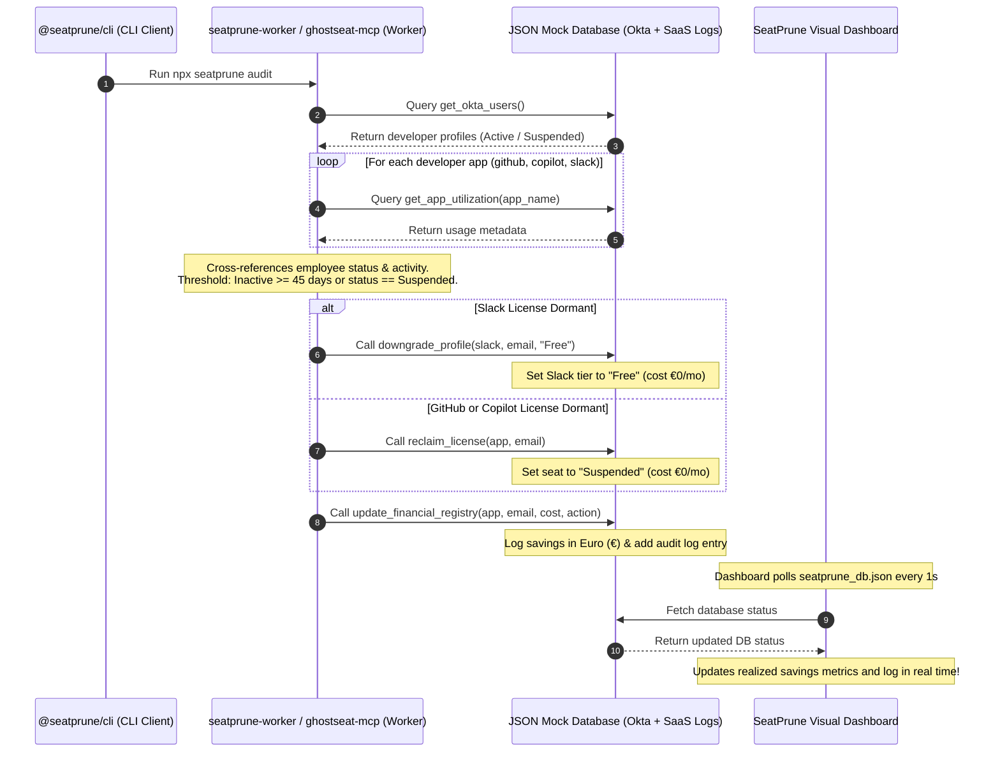

# SeatPrune: GitHub FinOps & License Reclamation MCP Server

[](https://smithery.ai/servers/skildunne/seatprune)

> **Landing Page Hook**: *"SeatPrune: The zero-config Cloudflare Worker that audits GitHub, Copilot, and Slack to recover €500+/month in dormant developer licenses."*

SeatPrune implements a standardized context-sharing protocol between an Identity Provider (like Okta) and SaaS application utilization logs to audit, reclaim, and downgrade unused or dormant developer seats in real time.

---

## 📐 Architecture Flow



---

## 🚀 Key Architectural Features

* **Standardized Context-Sharing Protocol**: Structured JSON schema that maps Okta identity groups (statuses, names, departments) directly to developer tool logs (last active date, cost, tier).
* **Worker & MCP Server (`ghostseat-mcp`)**: Runs a FastMCP server exposing database query and reclamation endpoints while hosting the dashboard on port `8085`.
* **Package & CLI (`@seatprune/cli`)**: Packaged command execution via `seatprune_cli.py audit` implementing the Antigravity Agent and rule-based fallback controller.
* **Premium Landing Dashboard**: A dark-mode HTML visualizer polling database changes, demonstrating savings (>€500/mo), seat state grids, and real-time audit logs in Euros (€).

---

## 🛠️ Exposed MCP Tools & Resources

### Tools
* `get_okta_users()`: Returns Okta directories.
* `get_app_utilization(app_name)`: Returns logs for `github`, `copilot`, or `slack`.
* `reclaim_license(app_name, user_email)`: Deprovisions a user seat (Suspended/€0.00).
* `downgrade_profile(app_name, user_email, target_role)`: Downgrades user seat (Free/€0.00).
* `update_financial_registry(app_name, user_email, monthly_cost, action_type)`: Logs monthly and annualized savings.

### Resources
* `seatprune://logs/savings`: Retrieves savings registry details.
* `seatprune://audit/summary`: Retrieves active seat count and detection summary.

---

## ⚡ Running the Simulation

### 1. Run Scenario Tests
```bash
PYTHONPATH=seatprune venv/bin/pytest seatprune/tests/test_seatprune.py
```

### 2. Run Scenario Simulation
Run the full scenario validator which resets the database, starts the server, executes the audit CLI command, and checks all savings assertions:
```bash
venv/bin/python seatprune/validate_seatprune_scenario.py
```

### 3. Start Dashboard Server
Start the server in background:
```bash
venv/bin/python seatprune/ghostseat_mcp.py
```
Open `http://localhost:8085` in your browser to view the live dashboard and landing page.
